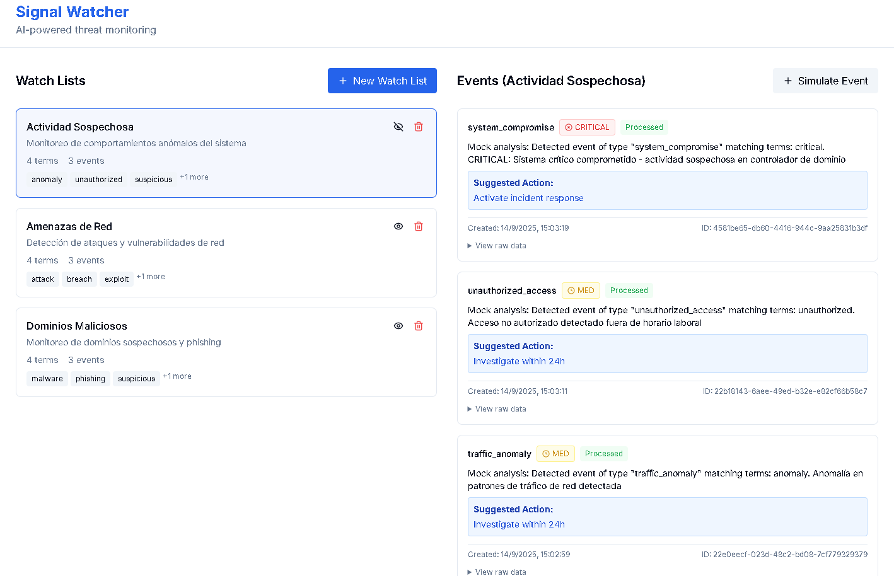

# Signal Watcher

AI-powered signal monitoring system for security threat detection and analysis.



## 🚀 Features

- **Watch Lists Management**: Create and manage lists of security terms to monitor
- **Event Simulation**: Simulate security events for testing and demonstration
- **AI Analysis**: Automatic event analysis with OpenAI integration (with mock fallback)
- **Real-time Processing**: Asynchronous event processing with Redis caching
- **Structured Logging**: Comprehensive logging with correlation IDs for traceability
- **Modern UI**: Clean, responsive interface built with Next.js and Tailwind CSS

## 🏗️ Architecture

```
┌─────────────────┐    ┌─────────────────┐    ┌─────────────────┐
│   Frontend      │    │    Backend      │    │   External      │
│   (Next.js)     │◄──►│   (Node.js)     │◄──►│   Services      │
│                 │    │                 │    │                 │
│ • React UI      │    │ • Express API   │    │ • OpenAI API    │
│ • Tailwind CSS  │    │ • Prisma ORM    │    │ • PostgreSQL    │
│ • TypeScript    │    │ • Redis Cache   │    │ • Redis         │
└─────────────────┘    └─────────────────┘    └─────────────────┘
```

## 🛠️ Tech Stack

### Backend
- **Node.js** + **TypeScript** - Runtime and type safety
- **Express** - Web framework
- **Prisma** - Database ORM
- **PostgreSQL** - Primary database
- **Redis** - Caching layer
- **OpenAI API** - AI analysis (with mock fallback)
- **Winston** - Structured logging
- **Zod** - Runtime validation

### Frontend
- **Next.js 14** - React framework with App Router
- **TypeScript** - Type safety
- **Tailwind CSS** - Styling
- **Radix UI** - Accessible components

### DevOps
- **Docker** - Containerization
- **GitHub Actions** - CI/CD pipeline
- **Vercel** - Frontend deployment
- **Railway/Render** - Backend deployment options

## 🚀 Quick Start

### Prerequisites
- Node.js 18+
- Docker & Docker Compose
- PostgreSQL (or use Docker)
- Redis (or use Docker)

### Development Setup

1. **Clone and install dependencies**
```bash
git clone <repository-url>
cd signal-watcher
npm install
```

2. **Start infrastructure with Docker**
```bash
docker-compose up postgres redis -d
```

3. **Setup environment variables**
```bash
cp .env.example .env
# Edit .env with your configuration
```

4. **Setup database**
```bash
cd backend
npm run db:push
npm run db:generate
```

5. **Start development servers**
```bash
# From root directory
npm run dev
```

This will start:
- Backend API on http://localhost:3001
- Frontend on http://localhost:3000

### Using Docker (Full Stack)

```bash
docker-compose up --build
```

## 📖 API Documentation

### Watch Lists

#### Create Watch List
```http
POST /api/watch-lists
Content-Type: application/json

{
  "name": "Suspicious Domains",
  "description": "Monitoring suspicious domain registrations",
  "terms": ["malware", "phishing", "suspicious-domain.com"]
}
```

#### Get Watch Lists
```http
GET /api/watch-lists
```

#### Get Watch List
```http
GET /api/watch-lists/:id
```

#### Delete Watch List
```http
DELETE /api/watch-lists/:id
```

### Events

#### Create Event
```http
POST /api/events
Content-Type: application/json

{
  "watchListId": "clp123...",
  "eventData": {
    "type": "domain_detection",
    "domain": "suspicious-site.com",
    "description": "New domain registered with suspicious patterns",
    "metadata": {
      "registrar": "Unknown",
      "creation_date": "2024-01-15T10:00:00Z"
    }
  }
}
```

#### Get Events
```http
GET /api/events?watchListId=clp123...
```

#### Get Event
```http
GET /api/events/:id
```

## 🤖 AI Integration

The system integrates with OpenAI's GPT-3.5-turbo for event analysis:

- **Summary Generation**: Natural language summaries of security events
- **Severity Classification**: Automatic severity rating (LOW/MED/HIGH/CRITICAL)
- **Action Suggestions**: Recommended next steps for analysts

### Mock Mode
When `OPENAI_API_KEY` is not provided, the system automatically falls back to mock mode for development and testing.

## 🔍 Observability

### Logging
- Structured JSON logs with Winston
- Correlation IDs for request tracing
- Different log levels (error, warn, info, debug)

### Metrics
- Request/response logging
- Error tracking
- Performance monitoring

### Health Checks
```http
GET /health
```

## 🚀 Deployment

### Frontend (Vercel)
1. Connect your GitHub repository to Vercel
2. Set environment variables in Vercel dashboard
3. Deploy automatically on push to main

### Backend Options

#### Railway
```bash
# Install Railway CLI
npm install -g @railway/cli

# Login and deploy
railway login
railway link
railway up
```

#### Render
1. Connect GitHub repository
2. Configure environment variables
3. Deploy as web service

#### Docker
```bash
# Build and push to registry
docker build -t signal-watcher-backend ./backend
docker push your-registry/signal-watcher-backend

# Deploy to your container platform
```

## 🧪 Testing

### Backend Tests
```bash
cd backend
npm test
```

### Frontend Tests
```bash
cd frontend
npm test
```

### E2E Testing
```bash
npm run test:e2e
```

## 📊 Monitoring

### Application Metrics
- API response times
- Error rates
- Cache hit rates
- AI processing times

### Infrastructure Metrics
- Database connections
- Redis memory usage
- Container resource usage

## 🔒 Security

- **Input Validation**: Zod schemas for all API inputs
- **Rate Limiting**: Express rate limiter
- **CORS**: Configured for frontend domain
- **Helmet**: Security headers
- **Environment Variables**: Sensitive data in env vars
- **SQL Injection Protection**: Prisma ORM parameterized queries

## 🤝 Contributing

1. Fork the repository
2. Create a feature branch
3. Make your changes
4. Add tests
5. Submit a pull request

## 📄 License

MIT License - see LICENSE file for details

## 🆘 Support

For issues and questions:
1. Check the [troubleshooting guide](docs/TROUBLESHOOTING.md)
2. Review the [runbook](docs/RUNBOOK.md)
3. Check [deployment notes](docs/DEPLOYMENT_NOTES.md)
4. Open an issue on GitHub

## 🌐 Live Demo

- **Frontend**: https://signal-watcher-frontend.netlify.app
- **Backend API**: https://signal-watcher-1.onrender.com
- **Health Check**: https://signal-watcher-1.onrender.com/health

*Demo includes sample data with 3 watch lists and 9 security events*